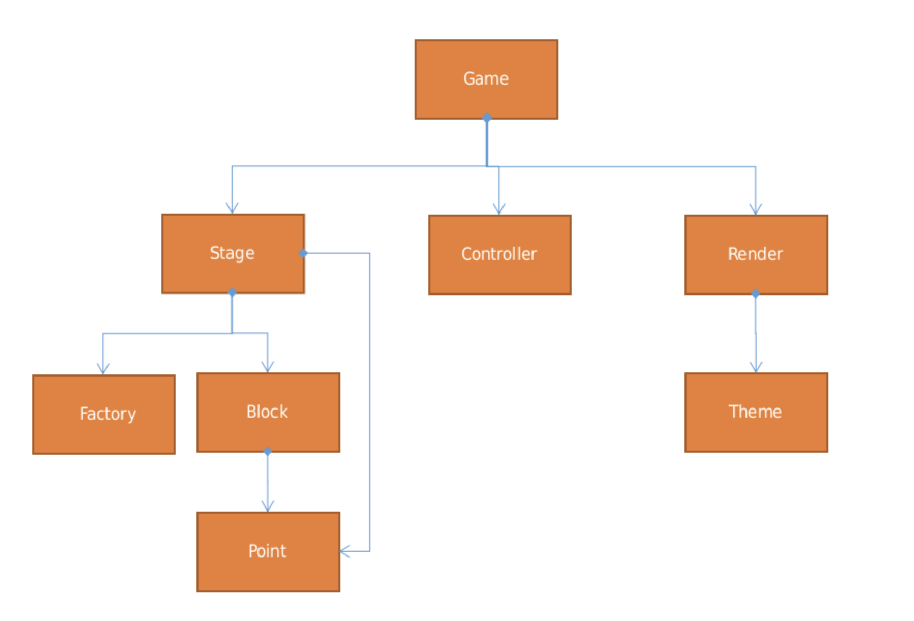

# 手撸俄罗斯方块——游戏设计

## 概述

上一章我们介绍俄罗斯方块的基本信息，包括坐标点和方块的基本概念，这一章节我们继续介绍如何完成后续的游戏设计。

## 组成游戏的基本要素

俄罗斯方块作为一个 2D 的平面游戏，我们可以将整个参与元素做如下抽象，如下图：



- **游戏(Game)**：游戏的核心，负责控制游戏的开始、暂停、结束等。

- **舞台(Stage)**：游戏的舞台，是一个矩形的游戏区域，方块在舞台中移动和旋转。

  - **方块(Block)**：游戏的基本元素，包括各种形状的方块，每个方块由 4 个小方块组成。

  - **工厂(Factory)**：方块的生成器，负责生成不同形状的方块。

- **控制器(Controller)**: 游戏控制器，用于注册事件，如键盘事件、鼠标事件等；

- **渲染(Render)**：游戏的渲染器，负责将游戏的状态渲染到屏幕上。

  - **主题(Theme)**：游戏的主题，包括游戏的背景、方块的颜色等。

简单描述为：

1. 通过`工厂(Factory)`产生`方块(Block)`。

2. `方块(Block)`在`舞台(Stage)`中移动和旋转。

3. `控制器(Controller)`监听用户输入，方块的移动和旋转是通过`游戏(Game)`实例做总体控制。

4. 游戏的状态通过`渲染(Render)`渲染到屏幕上，输出样式由`主题(Theme)`进行控制。

## Factory

工厂的目标是为了产生方块，因此它只需要提供产生方块的能力即可。可以抽象如下：

```javascript
export abstract class AbstractFactory {
  abstract randomBlock(): Block;
}
```

没错，`AbstractFactory`只需要提供一个`randomBlock`，其随机产生一个方块。

## Stage

Stage 作为整个游戏的舞台，它将方块进行组合，同时对外暴露一些能力，如：

- tick，步进能力，包含三个操作： 生产新的方块、方块向下移动和方块结算。
- rotate，旋转能力。
- move，移动能力
- reset，重置能力

除此之外，还需要提供几个状态的判断能力：

- isOver，是否结束，`tick`无法继续。

为了完成上述能力，我们需要对一些信息进行存储，也是封装在`Stage`中。

- current: Block，当前正在移动的方块。其要么是空，要么是一个固定的方块。
- next： Block，下一个方块。
- score： number，得分。
- points： Point[][]，一个二位数组，坐标轴的填充情况。
- dimension： Dimension，定义坐标轴的可操作区域，所有的方块不能操作该区域。
- factory： 方块生成器。

```javascript
type Direction = "up" | "left" | "down" | "right";
class Dimension {
  xSize: number; // x坐标轴的最大值
  ySize: number; // y坐标轴的最大值
}

class Stage {
  current: null | Block;
  next: null | Block;
  score: number;
  points: Point[][];
  dimension: Demension;

  tick() {}
  rotate() {}
  move(direction: Direction) {}
  reset() {}
}
```

## Game

Game 作为程序的主入口，将多个元素进行聚合，并控制游戏的开始和结束。

我们首先来分析它的属性，它至少要包括如下属性：

- status，游戏的状态，分别是 Ready、Running、Pause、Stop、Over。
- stage，游戏的舞台。
- render，渲染器
- controller，控制器

它的目标是通过定时器来控制 Stage 的步进(tick)，通过 contoller 监听用户输入，控制移动和旋转。

逻辑如下：

```javascript
export interface GameOptions {
  dimension: Dimension;
  canvas: AbstractCanvas;
  factory?: AbstractFactory;
  controller?: AbstractController;
}

export enum GameStatus {
  UNREADY = 0,
  READY = 1,
  RUNNING = 2,
  PAUSE = 3,
  STOP = 4,
  OVER = 5
}

export class Game {
  controller?: AbstractController;
  canvas: AbstractCanvas;
  options: GameOptions;
  dimension: Dimension;
  stage: Stage;
  status: GameStatus;
  // 开始
  start() {}
  // 暂停
  pause() {}
  // 停止
  stop() {}
  // 旋转
  rotate() {}
  // 移动
  move(direction: Direction) {}
  toggle() {}
  destroy() {}
}
```

## Render

对舞台进行渲染。一般对于游戏渲染，主要包括两个阶段：

- 首次渲染，渲染基本场景；
- 更新渲染，舞台发生变化时进行更新渲染。处于性能考量，更新时最好使用局部渲染。

定义如下：

```javascript
class AbstractRender {
  theme: Theme;
  render(): void; // 首次渲染
  update(): void; // 更新渲染
}
```

## Theme

为了确定游戏的背景，我们需要将游戏区域进行划分。划分如下图：


从上到下，我们可以将整个操作界面分为如下区域：

- 外框区域： 包括外框的颜色和整体的背景，以及外框的样式；

- 分数区域： 用于显示分数；

- 当前图形： 显示当前正在移动的方块；

- 下一图形： 显示接下来要出现的方块；

- 游戏状态： 显示当前游戏的状态，如： 游戏暂停；

- 已填充图形： 显示已填充的图形；

按照上述划分，我们可以将`theme`抽象为如下：

```javascript
abstract class AbstractTheme {
  /**
   * 设置外框的样式，如外框的颜色、整体的背景等。
   * @param outer 指代外框对象的元素，通过修改其内容改变显示样式。
   */
  abstract outStyle(outer: any): void;
  /**
   * 设置内框的样式，如内框的颜色、整体的背景等。
   * @param inner 指代内框对象的元素，通过修改其内容改变显示样式。
   */
  abstract innerStyle(inner: any): void;
  /**
   * 设置分数的样式。
   * @param score 指代分数对象的元素，通过修改其内容改变显示样式。
   */
  abstract scoreStyle(score: any): void;
  /**
   * 设置状态栏的样式
   * @param status 指代状态对象的元素。
   */
  abstract statusStyle(status: any): void;
  /**
   * 分数的格式化字符串，输入一个分数的数字，将其转换为目标的样式；
   * @param score {number} 当前游戏的分数
   */
  abstract scoreTemplate(score: number): string;
  abstract nextStyle(blocks: any): void;
  abstract currentStyle(current: any): void;
  /**
   * 设置方块区域的样式
   * @param block 指代当前方块区域
   */
  abstract blockStyle(block: any): void;
  /**
   * 设置current区域和已填充区域的小方块的样式
   * @param blockItem 当前小方块，如一个IBlock会拆分成4各BlockItem。
   * @param point 当前小方块的位置信息，包括`x`轴和`y`轴的坐标等信息
   */
  abstract blockPointStyle(blockItem: any, point: Point): void;
  /**
   * 设置next区域的小方块的样式
   * @param blockItem
   * @param point
   */
  abstract nextPointStyle(blockItem: any, point: Point): void;
}
```

## 小结

本章主要描述了俄罗斯方块的几个控制元素，也仅仅是几个相关的骨架。后续章节将进一步介绍方块的设计。
