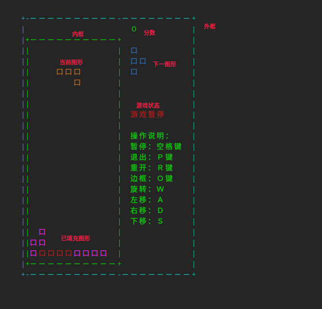

# 手撸俄罗斯方块——渲染与交互

## 如何渲染游戏界面

我们知道，当我们看到页面先呈现图像时，实际上看到的是一张图片，多张图片按照一定的刷新频率进行切换，则变成了动态的视频。当刷新频率超过24Hz时，人眼不会察觉到卡顿情况。

因此，一个简单的方案呼之欲出，我们只需要按照`1000 / 24 = 41.7ms`的时间间隔整体刷新一下频率即可。 



对于俄罗斯方块而言，从上到下，我们可以将整个操作界面分为如下区域：

* 外框区域： 包括外框的颜色和整体的背景，以及外框的样式；

* 分数区域： 用于显示分数；

* 当前图形： 显示当前正在移动的方块；

* 下一图形： 显示接下来要出现的方块；

* 游戏状态： 显示当前游戏的状态，如： 游戏暂停；

* 已填充图形： 显示已填充的图形；

我们有两种方式进行处理：

1. 每次刷新时重新渲染所有部分。该方法处理逻辑简单，清空全局区域，渲染有效区域。

2. 每次刷新时仅渲染更新区域。该方法能减少页面整体重绘，提交渲染效率，但相对来说处理复杂，控制逻辑较多。

但是，有些场景却无法使用局部刷新，如控制台渲染。

下面我分别以控制台渲染和DOM渲染为例，分别讲述如何实现渲染。

## 控制台渲染

按照上文描述，我们将渲染过程进行了抽象，包括了首次渲染和更新渲染，如下：

```javascript
import { Canvas } from '@shushanfx/teris-core';
class ConsoleCanvas extends Canvas {
  render(): void {

  }
  update(): void {

  }
}
```

对于控制台而言，每次更新实际上也是渲染全部区域，因此我们可以定义`update`为：

```javascript
class ConsoleCanvas extends Canvas {
  update(): void {
    this.render();
  }
}
```

那么接下来的问题就是如何实现`render`方法。

### render实现

render为全局渲染，在渲染之前需要首先清除控制台。我们可以使用如下代码表示渲染逻辑：

```javascript
render() {
  const printArray = [];
  // 1. 清空可视区域
  console.clear();
  // 2. array填充
  // ...
  // 3. 打印array
  print(printArray);
}
```

### array的填充

将整个渲染区域分解成一个个字符，多个字符组合组装成画面。这个是控制台游戏的特点。

我们俄罗斯方块游戏的特点：

1. 第一行显示为外边框的上边框；
2. 第二行显示为分数；
3. 第三行为内边框的上边框；
4. 游戏核心区域渲染，包括填充方块、下一个方块、游戏帮助、游戏状态等字符；
5. 内边框的下边框；
6. 外边框的下边框。


1. 渲染外边框的上边框时：

```javascript
const outLine1 = this.getOutterLine(
  this.leftTopChar +
  this.createChar(xSize + 2 + this.rightWidth, this.horizonalChar) +
  this.rightTopChar
);
printArray.push(outLine1);
```

包括`leftTopChar`、`horizonalChar`、`rightTopChar`。

2. 渲染分数：

```javascript
// 2. 渲染score
const scoreText = this.theme.scoreTemplate(score);
const scoreConsoleChar = ConsoleChar.create(scoreText);
this.theme.scoreStyle(scoreConsoleChar);
// 计算左侧需要补充的空格
const leftSpace = this.rightWidth - scoreText.length - 3;
// 右侧需要补充的空格
const rightSpace = 3;
let scoreLine =
  this.getOutterLine(this.verticalChar) +
  this.createChar(xSize + 2 + leftSpace) +
  scoreConsoleChar.ch +
  this.createChar(rightSpace) +
  this.getOutterLine(this.verticalChar);
printArray.push(scoreLine);
```

* 1~3行，用于生成score的文本和样式，后续在`theme`中会描述。
* 5行，计算左侧补充的空格数
* 7行，右侧补充的空格数
* 添加scoreLine，包括verticalChar，左侧空格，分数，右侧空格，verticalChar。

3. 渲染内边框的上边框

```javascript
// 3. 渲染内边框的上边框
let line1 =
  this.getOutterLine(this.verticalChar) +
  this.getInnerLine(this.leftTopChar);
for (let x = 0; x < xSize; x++) {
  const oneBlockItem = current?.points.find(item => item.x === x);
  if (oneBlockItem) {
    line1 += this.getInnerLine(bold(this.horizonalChar))
  } else {
    line1 += this.getInnerLine(this.horizonalChar)
  }
}
line1 +=
  this.getInnerLine(this.rightTopChar) +
  this.createChar(this.rightWidth) +
  this.getOutterLine(this.verticalChar);
printArray.push(line1);
```

内边框包括，`verticalChar`，`leftTopChar`、`horizonalChar`、空格和`verticalChar`。

4. 核心区域渲染

  游戏核心区域主要是一些方块，包括当前方块`currentBlock`，下一个方块`nextBlock`，已经落地的方块以及左右边框。

  基本思路为：

  41. 对于游戏区域，按照xSize x ySize维度，遍历每个点

    * 如果当前点存在points（已经固定的点）中，则渲染固定点；
    * 如果当前点包含在currentBlock中，则渲染当前活动的block。
    * 否则渲染空点

    ```javascript
    for (let y = 0; y < ySize; y++) {
      let rowLength = 2;
      let row = this.getOutterLine(this.verticalChar)
        + this.getInnerLine(this.verticalChar);
      for (let x = 0; x < xSize; x++) {
        const point = stage.points[y][x];
        const currentPoint = current
          ? current?.points.find((p) => p.x === x && p.y === y)
          : null;
        if (currentPoint || !point.isEmpty) {
          let consoleChar = new ConsoleChar(this.blockChar);
          this.theme.blockPointStyle(consoleChar, currentPoint || point);
          row += consoleChar.ch;
        } else {
          row += "　";
        }
      }
      rowLength += xSize;
      row += this.getInnerLine(this.verticalChar);
      rowLength += 1;

      // 渲染其他点位

      // 扣除末尾的结束符号
      const leftLength = outLength - rowLength - 1;
      if (leftLength > 0) {
        row += new Array(leftLength).fill("　").join("");
      }
      row += this.getOutterLine(this.verticalChar);
      printArray.push(row);
    }
    ```

    从上述代码来看，渲染逻辑很简单，先是渲染左侧外边框`verticalChar`、内边框`verticalChar`，之后渲染具体的方块，即如果方块包含在currentBlock或者不为空，则渲染方块，否则渲染空字符。之后，渲染内边框`verticalChar`，补充空格和外边框`verticalChar`。


  42. 渲染`nextBlock`

    从游戏区第一行开始，我们需要渲染`nextBlock`部分，因此实现逻辑如下：

    ```javascript
    // drawNext
    if (y >= 0 && y <= 4) {
      row += this.createChar(1);
      rowLength += 1;
      if (next) {
        let xStart = 0;
        let xEnd = 0;
        next.points.forEach((point) => {
          if (xStart === 0 || point.x < xStart) {
            xStart = point.x;
          }
          if (xEnd === 0 || point.x > xEnd) {
            xEnd = point.x;
          }
        });
        for (let x = xStart; x <= xEnd; x++) {
          const point = next.points.find((p) => p.x === x && p.y === y);
          let consoleChar: ConsoleChar | null = point
            ? new ConsoleChar(this.blockChar)
            : null;
          if (point) {
            this.theme.nextPointStyle(consoleChar, point);
          }
          row += consoleChar ? consoleChar.ch : "　";
          rowLength += 1;
        }
      }
    }
    ```
    需要说名的是`nextBlock`的x坐标并不是从0开始，需要先找到x坐标的最小值和最大值，然后再依次渲染对应的行。

    比如Block T，如果形状如下：
    
    ```javascript
    // 口
    // 口口
    // 口
    ```

    那么，`xStart`和`xEnd`的差值为1。y只有0-2是有效的行，其余均渲染为空格。


  43. 渲染游戏状态

    第7行，渲染游戏状态

    ```javascript
    else if (y === 6) {
      const { status } = game;
      if (status === GameStatus.PAUSE) {
        row += this.createChar(1) + this.getStatusLine("游戏暂停");
        rowLength += 5;
      } else if (status === GameStatus.OVER) {
        row += this.createChar(1) + this.getStatusLine("游戏结束");
        rowLength += 5;
      } else if (status === GameStatus.STOP) {
        row += this.createChar(1) + this.getStatusLine("游戏停止");
        rowLength += 5;
      }
    }
    ```

  44. 渲染游戏帮助

    从第9行开始，渲染游戏的帮助信息：

    ```javascript
    else if (y >= 8) {
      const messsage = this.createChar(1) + this.getHelpMessage(y - 8);
      row += messsage;
      rowLength += messsage.length;
    }
    ```

5. 渲染内边框的下边框

  ```javascript
  let line2 =
    this.getOutterLine(this.verticalChar) +
    this.getInnerLine(this.leftBottomChar);
  for (let x = 0; x < xSize; x++) {
    const oneBlockItem = current?.points.find(item => item.x === x);
    if (oneBlockItem) {
      line2 += this.getInnerLine(bold(this.horizonalChar))
    } else {
      line2 += this.getInnerLine(this.horizonalChar)
    }
  }
  line2 += this.getInnerLine(this.rightBottomChar) +
    this.createChar(this.rightWidth) +
    this.getOutterLine(this.verticalChar);
  printArray.push(line2);
  ```

  逻辑与渲染内边框的上边类似。

6. 渲染外边框的下边框

  ```javascript
  const outLine2 = this.getOutterLine(
    this.leftBottomChar +
    this.createChar(xSize + 2 + this.rightWidth, this.horizonalChar) +
    this.rightBottomChar
  );
  printArray.push(outLine2);
  ```

## 小结

本章主要讲述如何将游戏数据渲染成画面，以及渲染的一些通用的原理。渲染的本质是绘图，即告诉显示器如何绘制图像，通过不停的更新绘图实现动态的交互的效果。